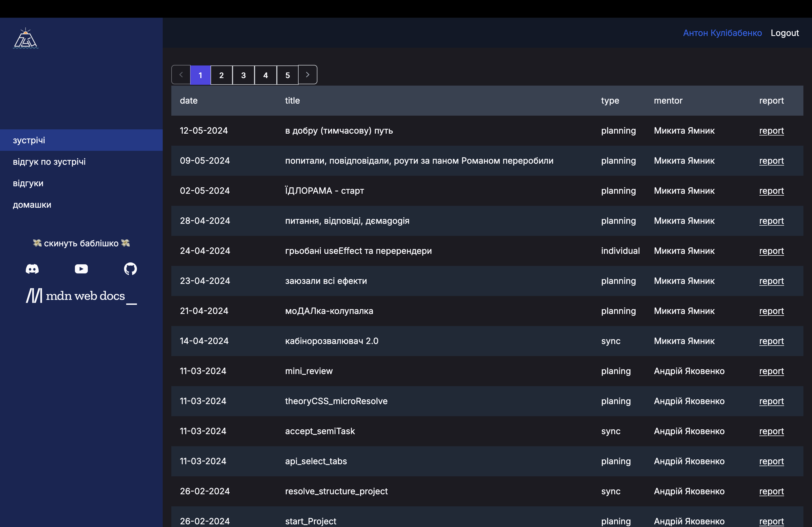

# Buoy Platform

> A full-stack learning management platform for students and mentors — track meeting reports, homeworks, payments, and feedback in one place.

<p style="display: flex; align-items: center; flex-wrap: wrap; gap: 0.5em;">
Client:


</p>
<p style="display: flex; align-items: center; flex-wrap: wrap; gap: 0.5em;">
Server:
  
  
  
  
  
  
  
  
</p>

---

## Features

- **JWT authentication** — secure token-based auth with protected routes
- **Reporting** — monitoring to keep track of covered topics, group and individual progress
- **Role-based access** — separate views and permissions for Students, Mentors, and Admins
- **Meetings** — track learning session reports and feedback
- **Feedback** — student and mentor feedback forms designed to provide accurate engagement tracking
- **Payments** — payment tracking with live Google Sheets sync

---

## Frontend Architecture

The client is a single-page application built with React 18 and TypeScript, structured around a few key design decisions:

- **Data fetching** — [TanStack Query](https://tanstack.com/query) handles all server state: caching, background refetching, and loading/error states, keeping components free of fetch logic
- **Forms** — [React Hook Form](https://react-hook-form.com/) with [Yup](https://github.com/jquense/yup) schema validation; a shared `formBuilder` utility generates consistent field configs across the app
- **Auth & routing** — JWT tokens are stored and managed via a React Context; a `<ProtectedRoute>` wrapper enforces role-based access at the route level using React Router v6
- **Global UI state** — a Modal context provides a single controlled modal channel, preventing stacked or orphaned overlays
- **API layer** — all HTTP calls are centralized in `client/src/api/`, with a shared Axios instance that attaches the auth token automatically
- **Path aliases** — both the client and server use `@/*` aliases, eliminating deep relative imports

---

## Tech Stack

| Layer            | Technologies                                                                                     |
| ---------------- | ------------------------------------------------------------------------------------------------ |
| **Frontend**     | React 18, TypeScript, Vite, Tailwind CSS, React Hook Form + Yup, TanStack Query, React Router v6 |
| **Backend**      | Node.js, Express, TypeScript                                                                     |
| **Database**     | MongoDB Atlas via Mongoose                                                                       |
| **Integrations** | Google Sheets API (payments sync via service account)                                            |
| **Auth**         | JWT, Bcrypt                                                                                      |
| **DevOps**       | GitHub Actions, PM2, DigitalOcean                                                                |

---

## Project Structure

```text
buoy-platform/
├── client/                  # React SPA (Vite)
│   └── src/
│       ├── api/             # Axios instance + per-resource request functions
│       ├── components/      # Reusable UI components (DataTable, Modal, Forms)
│       ├── context/         # React Context — Auth, Payments, Homeworks, Modal
│       ├── pages/           # Route-level page components
│       ├── routes/          # React Router setup + ProtectedRoute wrapper
│       ├── template/        # App shell — Header, Sidebar, Footer
│       ├── utils/           # formBuilder, shared helpers
│       └── types/           # TypeScript interfaces and enums
│
├── server/                  # Express REST API
│   └── src/
│       ├── controllers/     # Request handlers (auth, meetings, payments, …)
│       ├── model/           # Mongoose schemas — User, Meeting, Homework, Payment, Feedback
│       ├── routes/          # Express route definitions
│       ├── utils/           # JWT helpers, auth middleware, pagination
│       └── types/           # Shared TypeScript types and enums
│
├── .github/workflows/       # CI/CD — build + deploy pipeline
├── ecosystem.config.js      # PM2 process configuration
└── package.json             # Monorepo root — workspace scripts
```

---

## Getting Started

### Prerequisites

- Node.js LTS
- Yarn
- MongoDB Atlas cluster
- Google Cloud service account (for Sheets integration)

### Installation

```bash
git clone https://github.com/yamnyk/buoy-platform.git
cd buoy-platform
yarn install
```

### Environment Setup

Create `server/.env` from the template below:

```bash
SERVER_PORT=8004
SECRET_KEY=your_jwt_secret
TOKEN_EXPIRES_IN=7d
DB_URL=mongodb+srv://<user>:<password>@cluster.mongodb.net/buoy

# Google Service Account
GOOGLE_PROJECT_ID=
GOOGLE_PRIVATE_KEY_ID=
GOOGLE_PRIVATE_KEY=
GOOGLE_CLIENT_EMAIL=
GOOGLE_CLIENT_ID=
GOOGLE_AUTH_URI=
GOOGLE_TOKEN_URI=
GOOGLE_AUTH_PROVIDER_CERT_URL=
GOOGLE_CLIENT_CERT_URL=
```

---

## Development

Run the frontend and backend dev servers in separate terminals:

```bash
# Express backend with hot reload
yarn dev:server

# Vite frontend — proxies /api → localhost:8004
yarn dev:client
```

---

## Build

```bash
yarn build          # Full production build (client → server → bundle)

yarn build:client   # Compile React app with Vite
yarn build:server   # Compile TypeScript server
yarn build:cts      # Copy client dist into server/dist/public
```

The resulting `server/dist/` directory contains both the REST API and the compiled SPA, served by a single Express process.

---

## Deployment

CI/CD is handled by GitHub Actions (`.github/workflows/deploy.yml`):

1. **Build job** — triggered on every push and PR; compiles and packages a `bundle.tar.gz` artifact
2. **Deploy job** — triggers on `master` pushes only; SCPs the bundle to a DigitalOcean droplet and reloads PM2

### Required GitHub Secrets

| Secret              | Description        |
| ------------------- | ------------------ |
| `DO_HOST`           | Droplet IP address |
| `DO_USER`           | SSH username       |
| `DO_SSH_KEY`        | Private SSH key    |
| `DO_SSH_PASSPHRASE` | SSH key passphrase |
| `DO_SSH_PORT`       | SSH port           |

### Manual start

```bash
pm2 start ecosystem.config.js
```

---

## Scripts Reference

| Command           | Description                           |
| ----------------- | ------------------------------------- |
| `yarn install`    | Install all workspace dependencies    |
| `yarn dev:client` | Start Vite dev server                 |
| `yarn dev:server` | Start Express with nodemon            |
| `yarn build`      | Full production build                 |
| `yarn start`      | Start production server               |
| `yarn prettify`   | Format all source files with Prettier |

---

## Screenshots

### Student role

#### Main screen

For each attended group or individual meeting, the student can access a report that mentors are required to fulfill.

> 

#### Feedbacks

A table of all student-submitted feedbacks during the learning path.

> 

#### Feedback form

Every student fills out a feedback form that is automatically accessible by the Admin role anonymously.

The form includes a checkbox for the student to decide whether a mentor can view the results. This setting is off by default and the student's name is never exposed, even after enabling it.

> 

### Mentor role

#### Creating a meeting report

> 

#### Accessing feedback

> 

---

## License

Private — all rights reserved.
